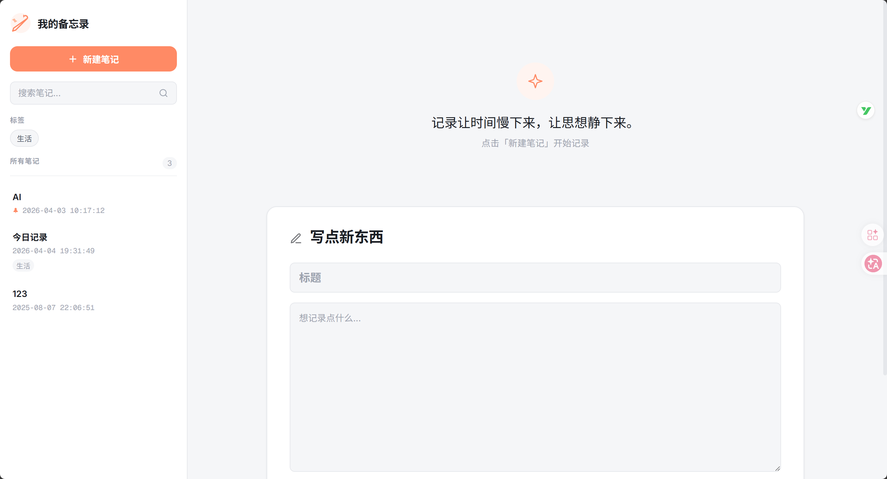
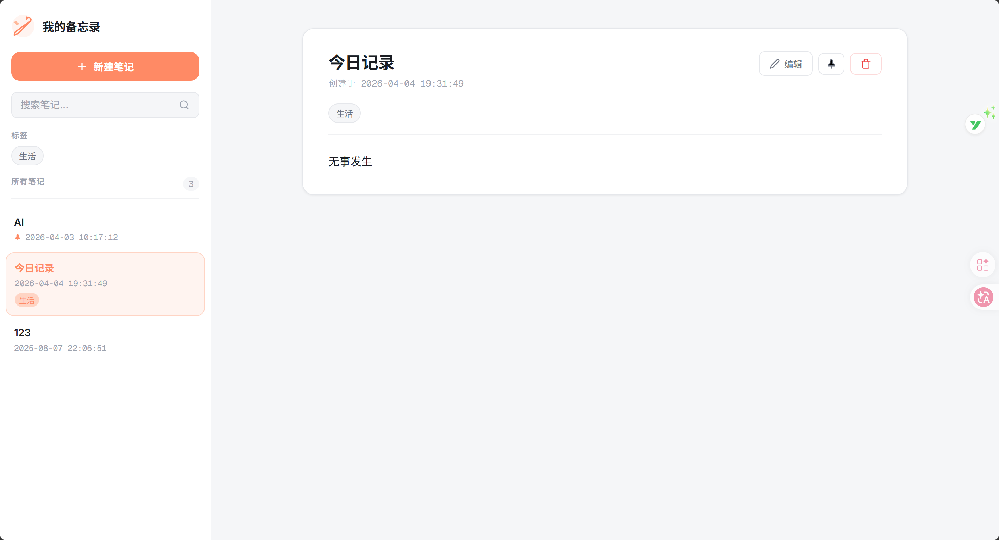
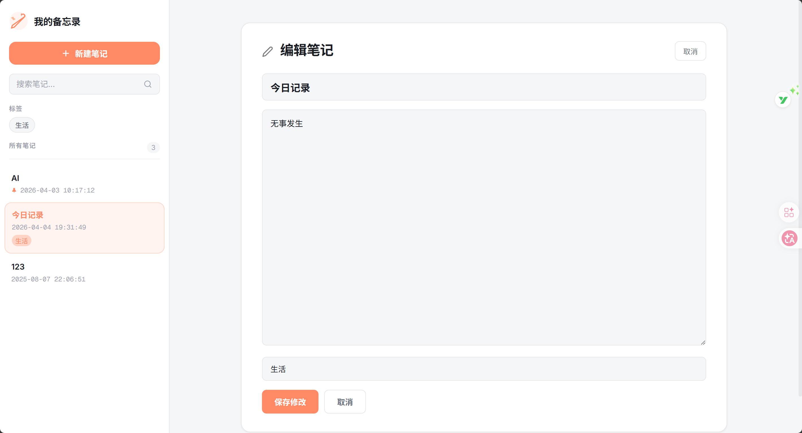
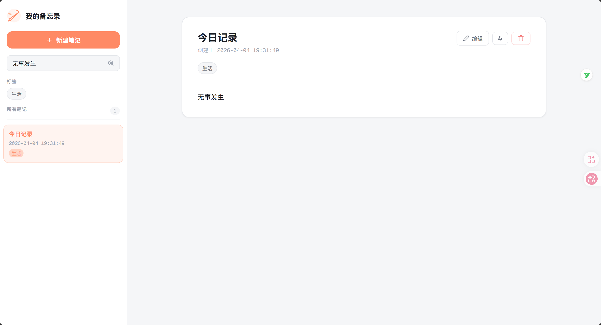
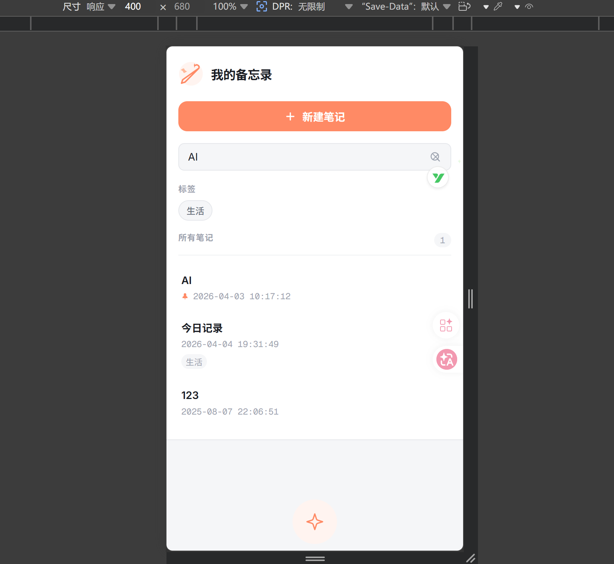

# Note · 备忘录应用

> 一个把工程化做透的轻量级备忘录 —— Flask 单文件应用 + JSON 文件锁持久化 + 自动备份恢复 + 4 阶段 CI 质量门(lint / 类型 / 测试 / 安全扫描)。

[](https://www.python.org/)
[](https://flask.palletsprojects.com/)
[](https://github.com/qrx-joe/note/actions/workflows/ci.yml)
[](LICENSE)
[](https://github.com/astral-sh/ruff)

---

## 📷 截图速览

| 首页 | 详情 |
|---|---|
|  |  |

| 编辑模式 | 标签筛选 |
|---|---|
|  |  |

| 移动端响应式 |
|---|
|  |

---

## ✨ 项目亮点

- **🛡️ 双层数据完整性保护** —— 写入前自动备份，加载失败自动从 `.bak` 恢复，备份再损坏才向上抛错
- **🔒 跨平台文件锁** —— `portalocker` 处理并发写入，Windows / Linux / macOS 一致行为
- **🛠️ 4 阶段 CI 质量门** —— lint(ruff) + 类型(mypy) + 测试(pytest, ≥50% 覆盖) + 安全扫描(bandit) 并行运行
- **🎨 三栏布局 + 暖橙主题** —— Inter / Outfit / Geist Mono 字体组合，CSS 变量主题系统，移动端响应式
- **🚀 Windows 一键启动** —— `start.bat` 自动探测 5000–5010 端口，避免端口占用导致启动失败
- **🩺 健康检查端点** —— `/health` 返回数据/备份文件状态，便于运维探活

---

## 🛠 技术栈

| 类别 | 选型 | 锁定版本 | 用途 |
|------|------|---------|------|
| 运行时 | Python | 3.13 | CI 锁定版本 |
| Web 框架 | Flask | 3.1.1 | HTTP 路由 + 模板渲染 |
| 安全 | Flask-WTF | 1.2.2 | CSRF 防护 |
| 并发安全 | portalocker | 3.2.0 | 跨平台文件锁 |
| 模板 | Jinja2 | 3.1.6 | 服务端渲染 |
| 前端 | 原生 HTML / CSS | — | 无框架，CSS 变量 + Flexbox |
| 包管理 | uv | latest | 替代 pip / poetry |
| Lint & Format | ruff | 0.9+ | 100x 速度的全能工具 |
| 类型检查 | mypy | 1.20+ | 静态类型分析 |
| 测试 | pytest + pytest-cov | 9.0 / 7.1 | 单元测试 + 覆盖率 |
| 安全扫描 | bandit | 1.9+ | Python 安全漏洞静态扫描 |
| CI/CD | GitHub Actions | — | 4 个并行 job |

---

## 🎯 核心技术决策与实现

### 1. 用文件锁 + JSON 而非数据库

- **决策**：`portalocker` 跨平台文件锁 + `memos.json` 持久化
- **权衡**：单文件依赖最小化 vs 高并发场景写性能受限
- **结果**：零外部依赖，部署只需 `python app.py`；备份与恢复天然简单（直接复制 JSON）
- **代码**：[`app.py:91-103`](app.py#L91-L103) `save_memos()`

### 2. 双层数据完整性保护

- **决策**：写入前自动 `shutil.copy2` 到 `.bak`；加载失败时自动从 `.bak` 恢复；两个文件都损坏才抛 `RuntimeError`
- **动机**：JSON 持久化最大风险是写入半截损坏文件，丢光历史
- **代码**：[`app.py:42-88`](app.py#L42-L88) `backup_data()` / `load_memos()`

### 3. CSRF 全局防护

- **决策**：Flask-WTF 全局注入，所有 POST 必带 `csrf_token`；密钥持久化到 `.secret_key` 文件
- **细节**：首次启动 `os.urandom(32)` 生成密钥并写文件，避免每次重启会话失效
- **代码**：[`app.py:23-32`](app.py#L23-L32)

### 4. 测试隔离设计

- **决策**：`pytest fixture` 用 `tempfile.TemporaryDirectory` + `monkeypatch` 拦截 4 个全局路径常量（DATA_FILE / BACKUP_FILE / LOCK_FILE / SECRET_KEY_FILE）
- **效果**：测试不污染真实数据；CI 跑测试不需要清理 fixture
- **代码**：[`tests/test_app.py:19-37`](tests/test_app.py#L19-L37)

### 5. CI 多维质量门

- **决策**：4 个 job 并行（lint / 类型 / 测试 / 安全扫描），任一失败合并被阻塞
- **细节**：`uv sync --locked` 锁定依赖、`pytest --cov-fail-under=50` 守住覆盖率底线、bandit 报告作为 artifact 上传留存
- **代码**：[`.github/workflows/ci.yml`](.github/workflows/ci.yml)

### 6. 输入校验前置

- **决策**：`validate_memo_input` 单独抽出，加 / 改两条路径共用；约束 `MAX_TITLE=200` / `MAX_CONTENT=50000` 防止超大内容打爆 JSON 解析
- **代码**：[`app.py:47-54`](app.py#L47-L54)

---

## 🔍 关键问题复盘

- **「先备份后写入」差点等于「先备份后销毁备份」**
  原来 `load_memos` 在 JSON 损坏时静默返回 `[]`，下一次 `save_memos` 又会先备份再写空列表 —— 等于**用空列表覆盖掉备份，数据彻底没了**。
  修复策略:JSON 损坏先尝试从 `.bak` 加载;备份也坏才抛 `RuntimeError`,**绝不返回空列表让上层继续运行**。
  → 见 [commit 482d0e0](https://github.com/qrx-joe/note/commit/482d0e0) + [commit 9503539](https://github.com/qrx-joe/note/commit/9503539)

- **多维排序的 `reverse=True` 是全局反转,跟 tuple key 一起用会暗坑**
  原写法：`sorted(memos, key=lambda m: (not m.get('pinned'), m.get('created_at')), reverse=True)` —— 看起来"置顶在前 + 新的在前",其实 `reverse=True` 把 pinned 维度也翻了过来,**置顶项掉到最后**。
  修复:利用 Python sorted 的稳定性,**拆成两次排序**——先按时间倒序,再按 pinned 稳定排。
  → 见 [commit 482d0e0](https://github.com/qrx-joe/note/commit/482d0e0)

- **数据文件混进 git 历史**
  `memos.json` 直到 2026-04-04 才被加进 `.gitignore`(项目已经迭代两周)。在那之前所有笔记内容都跟代码一起被 commit 了。
  教训：**`.gitignore` 必须在第一次 commit 前列清楚运行时产物**，事后补救清不掉历史里 leak 的内容。
  → 见 [commit 8e9cf95](https://github.com/qrx-joe/note/commit/8e9cf95)

- **Flask 默认 host 的"开发友好"= 上线不安全**
  `app.run()` 不显式传 host 时绑定 `127.0.0.1`，但很多教程写 `host="0.0.0.0"` 让局域网也能访问 —— 等于**同 WiFi 任何人都能读你的笔记**。这次主动改回 `127.0.0.1`。
  教训:**默认值的"DX 友好"和"prod 安全"经常相反,默认配置要主动审计。**
  → 见 [commit 49fc02c](https://github.com/qrx-joe/note/commit/49fc02c)

- **CI 不是「加完就走」,而是「五连修才全绿」**
  从 [f4c426b](https://github.com/qrx-joe/note/commit/f4c426b)(加流水线)到 [25562c6](https://github.com/qrx-joe/note/commit/25562c6)(修 bandit + 加 `--locked`),连续 5 个 commit 修复:CI 配置 → lint 错误 → ruff 规则 → format 风格 → 安全扫描误报。
  教训:**任何质量工具上线前,本地先全量跑一遍**;CI 是质量卡点,不是上传完就算赢。

- **Windows `.bat` 的两个隐蔽坑**
  ① 编码必须是 ANSI(GBK) + CRLF，UTF-8 / LF 会乱码或直接执行失败 → [commit 29cefcb](https://github.com/qrx-joe/note/commit/29cefcb)
  ② 错误时窗口秒退,用户看不到错误信息 → [commit 33159e6](https://github.com/qrx-joe/note/commit/33159e6),正常/异常路径都加 `pause`
  顺手加了 `.gitattributes` 强制 `.bat` 文件保留 CRLF,防止 git 跨平台 checkout 时被改成 LF。

- **bandit 误报:用 `# nosec` 内联抑制,而非全局忽略**
  扫描器把 `SECRET_KEY_FILE = ".secret_key"` 当成硬编码密码(B105),但它是文件名常量。
  方案对比:全局 `skips = ["B105"]` 风险高(真硬编码就放行了)、内联 `# nosec: B105` 精准且留痕。同时去掉了 CI 里 bandit 命令尾巴的 `|| true`,让真实安全问题能阻塞合并。
  → 见 [commit 25562c6](https://github.com/qrx-joe/note/commit/25562c6)

---

## 🚀 快速开始

### 环境要求

- Python 3.13+
- [uv](https://docs.astral.sh/uv/) 包管理器

### 安装与运行

```bash
git clone https://github.com/qrx-joe/note.git
cd note
uv venv             # 创建 .venv
uv sync             # 从 uv.lock 安装锁定版本
uv run app.py       # 启动应用
```

打开浏览器访问 <http://localhost:5000> 即可。

### Windows 一键启动

```cmd
start.bat
```

自动检测 5000–5010 端口并启动。

---

## 📁 项目结构

```
note/
├── app.py                      # Flask 应用主文件 (~286 行,单文件应用)
├── pyproject.toml              # 项目配置与依赖声明
├── uv.lock                     # 锁定的依赖版本
├── memos.json                  # 数据存储文件
├── memos.json.bak              # 自动备份文件
├── start.bat                   # Windows 一键启动脚本
├── .github/workflows/ci.yml    # GitHub Actions 流水线
├── static/style.css            # 样式表 (CSS 变量主题)
├── templates/index.html        # 单页应用模板 (Jinja2)
├── tests/test_app.py           # 单元测试 (15 用例)
└── docs/
    └── screenshots/            # 截图资源
```

---

## 🧪 开发与测试

```bash
# 全套质量门(本地预跑 CI)
uv run ruff check app.py tests/
uv run ruff format --check app.py tests/
uv run mypy app.py
uv run pytest tests/ -v --cov=app
uv run bandit -r app.py

# 添加依赖
uv add package-name           # 生产依赖
uv add --dev package-name     # 开发依赖
```

---

## ⚙️ CI/CD 流水线

每次推送到 `master` 分支自动触发 4 个并行 job：

| Job | 工具 | 失败条件 |
|------|------|---------|
| `lint` | ruff check + format | 任一规则不通过 |
| `type-check` | mypy | 类型错误 |
| `test` | pytest + pytest-cov | 用例失败 / 覆盖率 < 50% |
| `security` | bandit | 报告作为 artifact 上传 |

依赖通过 `uv sync --locked` 锁版本安装，杜绝「在我电脑上能跑」。

---

## 🔒 数据安全

- **自动备份**：每次保存前 `shutil.copy2` 到 `.bak`
- **损坏恢复**：主文件解析失败自动从备份加载，备份再损坏才抛错
- **文件锁**：`portalocker.Lock` 5 秒超时，防止并发写入互相覆盖
- **类型校验**：`save_memos` 入参必须是 `list`，防止误传 dict 写出非法格式
- **CSRF 防护**：Flask-WTF 全局保护所有变更操作
- **密钥持久化**：`.secret_key` 文件保存 32 字节随机密钥（已加入 `.gitignore`）

---

## ⚙️ 自定义配置

### 修改密钥

删除 `.secret_key`，下次启动自动生成新密钥（**注意**：现有会话会全部失效）。

### 修改主题色

`static/style.css` 顶部的 CSS 变量：

```css
:root {
    --accent: #FF8A65;        /* 主题色 */
    --accent-hover: #FF7A50;  /* 悬停色 */
    --accent-light: #FFF4F0;  /* 浅色背景 */
}
```

### 修改数据文件路径

`app.py:34-36`：

```python
DATA_FILE = "memos.json"
BACKUP_FILE = "memos.json.bak"
LOCK_FILE = "memos.lock"
```

---

---

## 📚 更多文档

- [演进路线图 (ROADMAP)](docs/IMPROVEMENT_SUGGESTIONS.md) —— 已完成功能 / 计划中 / 灵感池
- [截图资源](docs/screenshots/README.md) —— 截图文件索引与尺寸规范

---

## 📄 开源协议

MIT License — 详见 [LICENSE](LICENSE)。
